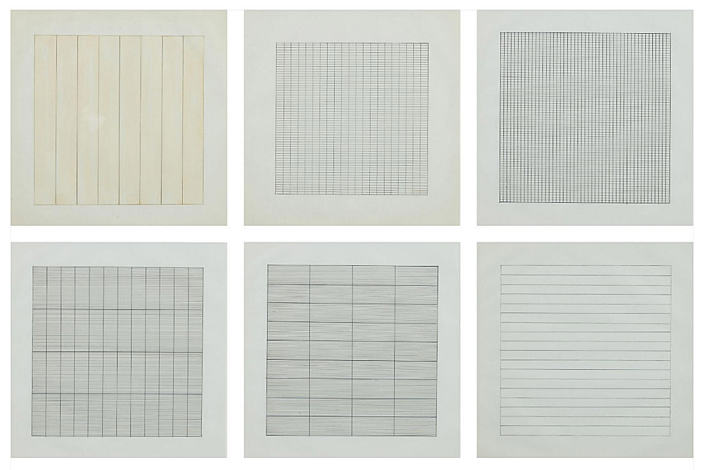

# Agnes: Minimalist finite elements

This is a simple 2D FEM assembly code with $P_1$ elements (linear basis functions on triangles). It grew out of an even more bare-bones code I wrote to help students produce example problems in my Fall 2020 Iterative Solvers course. The name Agnes is for the minimalist painter Agnes Martin.

